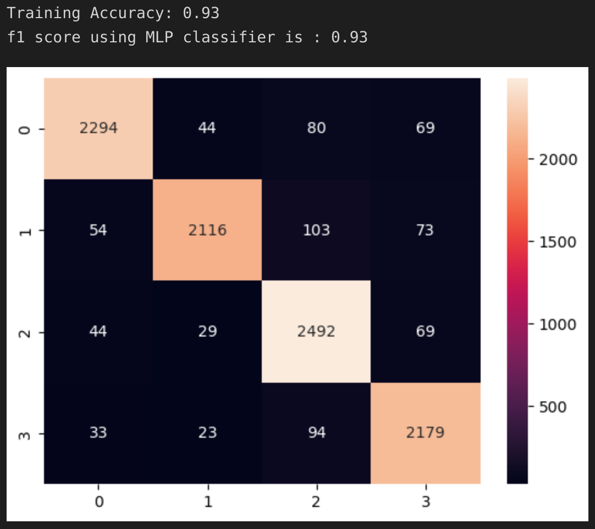
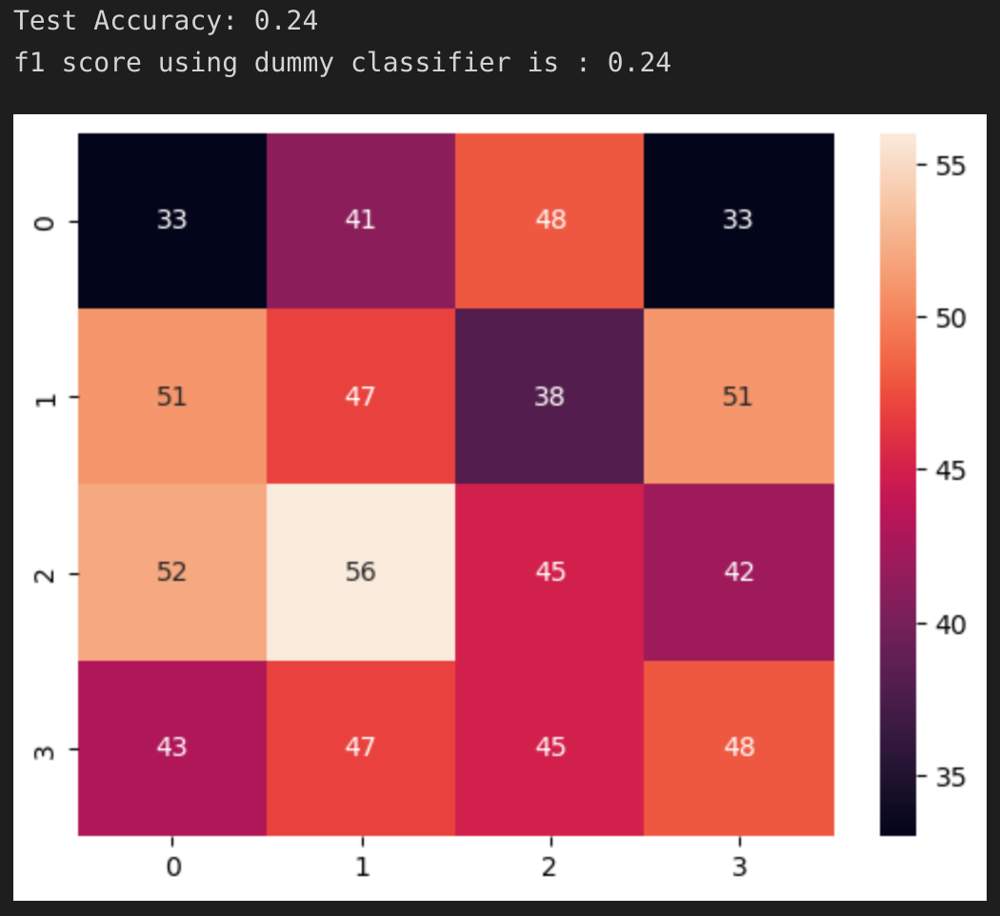

# NLP-Utterance-Classification

## Method Overview
Please note that David Steier of Carnegie Mellon University provided or inspired a significant portion of the framework utilized in the preprocessing module and model selection used in this project. 

The purpose of this project was to utilize Google's pretrained BERT model to classify utterances into different categories. The target categories selected were: 
* sad
* jealous
* joyful
* terrified

After filtering for these labels, the total number of observations in the training set was 9,769 and the test set had 720 observations. There was relatively equal distribution among the target lables so no methods to deal with class imbalance were employed in this project.

## Data Processing
Outside of filtering for certain labels, the Data_Processing.py module contains numerous functions designed to clean text data. For the purposes of the BERT model, none of these additional methods were called as BERT is capable of handling raw text. 

Other models, like a multi-layer perceptron or stochastic gradient descent classifier would need cleaned input before making predictions. The functions designed to peform additional cleaning are: 
* dataPreProcess: this function utilizes NLTK's WordNetLemmatizer to lemmatize verbs, nouns, adjectives, adverbs, and satellite adjective. This method also converts all text to lower case, converts contractions to full words, and has additional regular expressions to clean text germaine to this dataset.

## Modeling - BERT
After importing the uncleaned data, the training and test instances were split into batches as the GPU used in encoding did not have enough memory to contain the full dataset. BERT produces as vector with 768 columns that represents an encoding of the utterance. These encodings were then passed to Sci-Kit Learn's MLPClassifier. 

The training accuracy and f1 score for the MLP classifier was 94%. The confusion matrix is shown below:

The testing accuracy and f1 score for hte MLP classifier was 65%. The confusion matrix is shown below:

Based on the decrement in performance, and high training accuracy, it is reasonable to conclude that the model is overfitting on the training data. Due to processing constraints, hyper-parameter tuning through GridSearchCV was not included in the Model_BERT.ipynb file, however, this is certainly worth exploring in future iterations. 

## Modeling - Dummy Classifier
As expected, the pretrained BERT model outpreformed a dummy classifier. Numerous strategies for the dummy classifier were employed, namely uniform, prior, and stratified. These strategies all yielded similar results. Due to the classes being relatively balanced, a uniform strategy was employed on the dummy classification model. Both the train and test sets came in at approximately 25% accuracy (as expected for 4 target labels). The dummy classifier test performance is show below:

 

